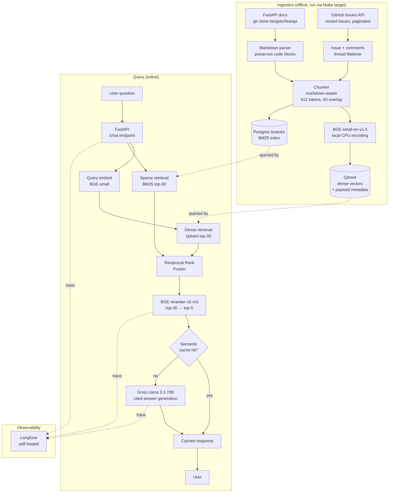
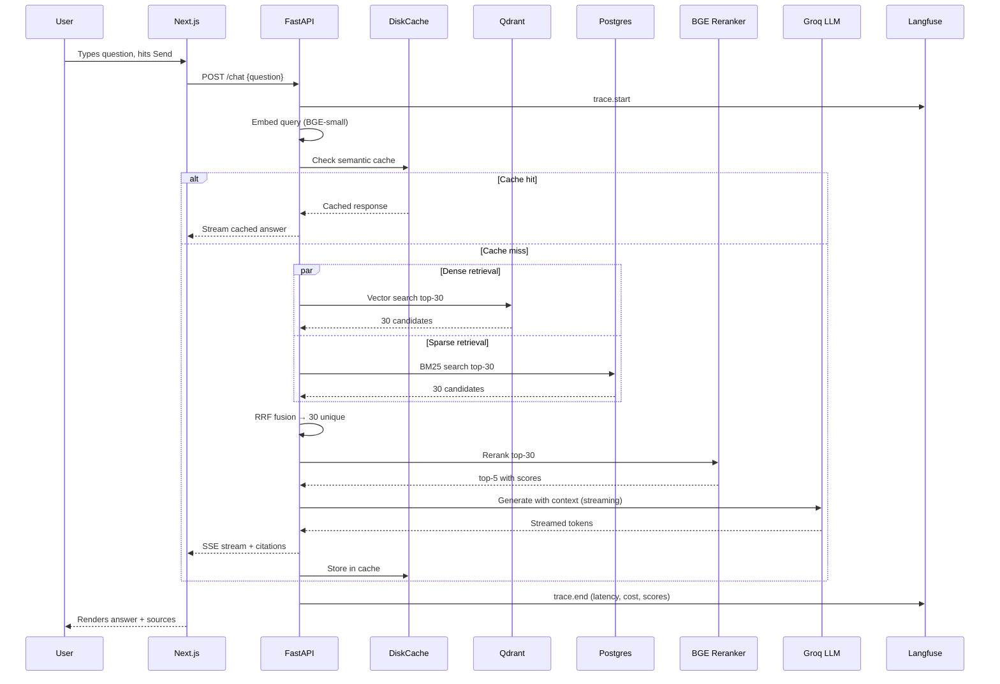

# Architecture

## System diagram

## Component breakdown

| Component | Responsibility |
|---|---|
| **Ingestion CLI** | One-shot script that clones FastAPI repo, fetches issues, chunks, embeds, indexes |
| **Qdrant** | Stores 384-dim BGE embeddings + payload (chunk text, source URL, type, metadata) |
| **Postgres** | Stores raw chunks for BM25 (`tsvector` column with GIN index) and feedback log |
| **Retrieval service** | Hybrid retriever: dense + sparse → RRF → rerank → top-k |
| **Generation service** | Builds prompt, calls Groq, parses citations, returns structured response |
| **Semantic cache** | DiskCache on disk, keyed by query embedding similarity (>0.97 threshold) |
| **FastAPI backend** | `/chat`, `/health`, `/feedback` endpoints; auth via API key header |
| **Next.js frontend** | Single-page chat UI with streaming responses and source rendering |
| **Langfuse** | Self-hosted observability; traces every request component |
| **GitHub Actions** | Lint (ruff), test (pytest), eval gate (Ragas on cached fixture) |

## Sequence diagram

