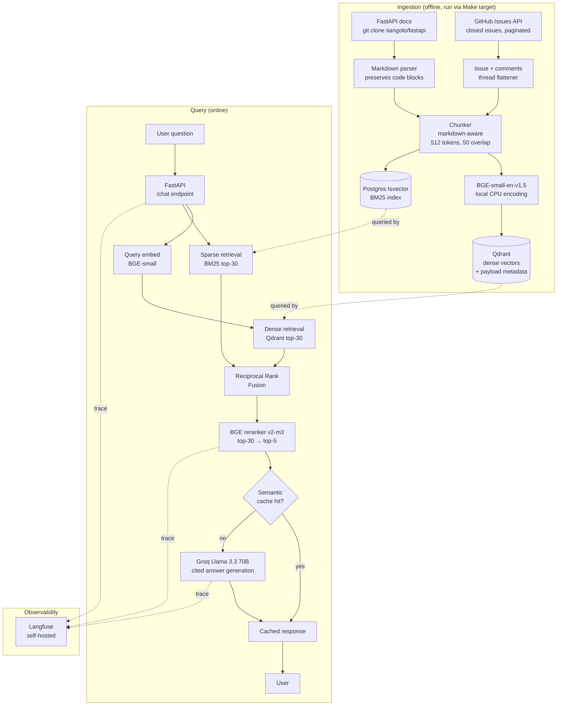
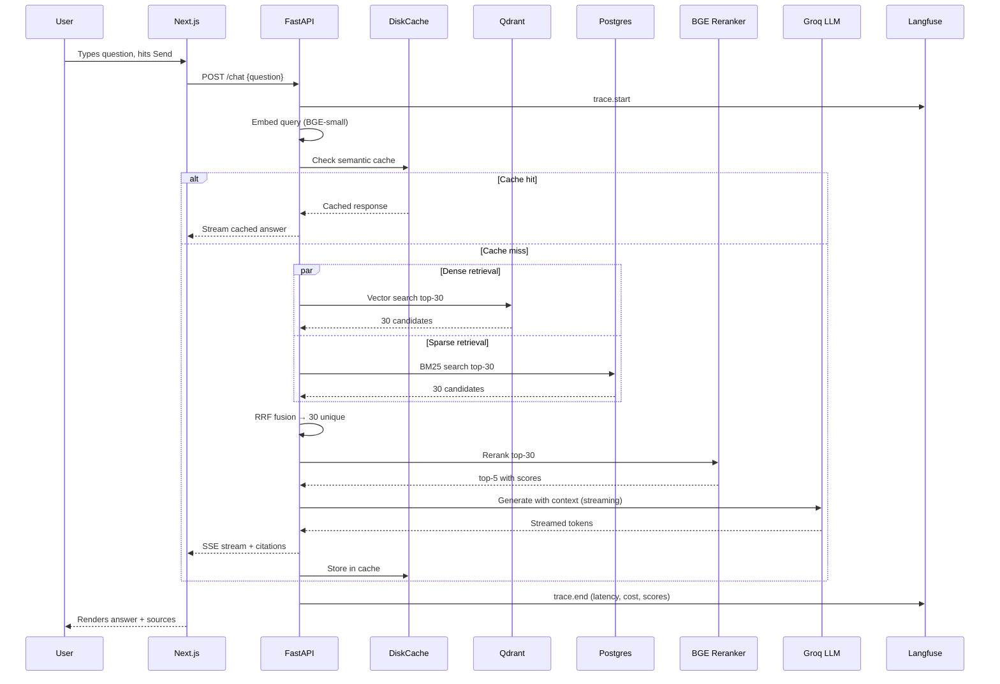

# `fastapi-helper` — Project Specification

> **Single source of truth for the build.** This document is self-contained. Every choice is made; nothing is "configure as needed."

---

## 1. Project Overview

### 1.1 Project name
**`fastapi-helper`** — a customer-support-style RAG assistant over the FastAPI documentation and GitHub issues.

> The name is deliberately specific. "Generic RAG demo" repos die in obscurity; named-project repos get attention. If the FastAPI maintainers happen to see it, that's a bonus.

### 1.2 One-line pitch
> *"An assistant that answers FastAPI questions by retrieving over the official docs and 5,000+ closed GitHub issues, with hybrid search, citation-grounded answers, and CI-gated evaluation."*

### 1.3 Problem statement
FastAPI is one of the most popular Python web frameworks, with extensive documentation and ~5,000 closed GitHub issues representing thousands of resolved real-world questions. New users land on questions Stack Overflow can't always answer well. The official docs are excellent but linear; finding the *one paragraph* that answers your specific question requires knowing the docs already.

A RAG assistant grounded in the docs *plus* historical issue resolutions covers cases the docs alone don't, and produces cited answers that link back to authoritative sources.

### 1.4 Target users
- Python developers learning FastAPI
- Engineers debugging FastAPI in production
- Hiring managers reviewing this portfolio (the meta-user)

### 1.5 Success criteria
The project is "done" when:

1. A live deployed URL serves chat requests end-to-end
2. The eval suite reports **faithfulness ≥ 0.85** and **context recall@5 ≥ 0.75** on a hand-curated 50-question eval set
3. CI runs the eval on every PR and blocks merges that drop either metric below threshold
4. Langfuse traces every production query with cost, latency, and retrieval scores
5. Three documented experiments comparing real configurations exist in `EXPERIMENTS.md` with real numbers
6. The README tells the story coherently in under 5 minutes of reading

### 1.6 Non-goals (explicit)
- **Not multi-tenant.** One corpus, one app.
- **Not a chatbot with persistent memory.** Single-turn Q&A; conversation history is a stretch goal only.
- **Not multi-modal.** Text only.
- **Not real-time index updates.** Re-ingestion is a manual command.
- **Not authenticated user accounts.** Simple API key for the API; UI is open.
- **Not a fine-tuned model.** Off-the-shelf models throughout.
- **Not a replacement for the FastAPI docs.** It complements them; it cites them.

---

## 2. The Solo Build Journey (your real story, not a fabricated one)

This section is here so the README, BLOG, demo video, and interview prep stay coherent. **Don't pre-write this. Live it, then write it at the end.** What follows is the *shape* of the story you'll fill in with real specifics from your build.

**The arc:**

1. **Motivation.** You wanted a first production-shipped portfolio project. You picked customer-support-style RAG because it's the most "real-job-like" RAG pattern. You picked FastAPI as the corpus because it's a project you respect, the docs are open, and the issue tracker has thousands of resolved questions = lots of natural eval signal.

2. **The "build it cheap" constraint.** Zero budget forced architectural choices that turned out to be educational: local embeddings (BGE-small via sentence-transformers), Qdrant in Docker, Groq's free tier for generation, Langfuse self-hosted. Every choice has an ADR.

3. **The first dumb version.** Naive recursive chunking, dense retrieval only, no reranker, no eval. It "felt" decent on a few queries and was deeply mediocre when you finally measured it.

4. **The eval inflection point.** Building the 50-question hand-curated eval set is when the project got serious. Suddenly "felt decent" became a number, and the number was bad.

5. **Three experiments that mattered.** Chunk size sweep, dense vs. hybrid, with vs. without reranker. You'll run these for real and the numbers will tell a story.

6. **The frontend and deployment scramble.** The unsexy 30% that takes 50% of the time.

7. **What surprised you / what you'd do differently.** Fill in at the end.

> **Note for future-you, when writing the BLOG:** specifics beat platitudes. "I learned about evaluation" is forgettable. "I learned that my naive chunker was splitting code blocks across chunks 38% of the time, which cratered retrieval on code-heavy queries until I switched to a markdown-aware splitter" is memorable. Save the specifics as they happen, in `LEARNINGS.md`, then mine them later.

---

## 3. Final Deliverables Checklist

When the project is done, all of these exist:

- [ ] **Live deployed URL** — backend on Fly.io, frontend on Vercel, both reachable from the public internet
- [ ] **Public GitHub repo** named `fastapi-helper`
- [ ] `README.md` — story-driven, per the template in §17
- [ ] `LEARNINGS.md` — your real session notes, accumulated as you build
- [ ] `EXPERIMENTS.md` — 3+ experiments with real numbers
- [ ] `docs/adr/` — 4–8 ADRs written at the moment of decision
- [ ] `BLOG.md` — ~1500-word writeup, written at the end
- [ ] **Mermaid architecture diagram** — embedded in README
- [ ] **Demo video** — 2–3 minutes, hosted on Loom or YouTube unlisted, linked in README
- [ ] **CI/CD** — GitHub Actions running lint + test + Ragas eval gate on every PR
- [ ] **Eval gate proof** — at least one PR in the history where the gate triggered (or, if none did, document that you tested it intentionally fails by tightening thresholds)
- [ ] **Resume bullet** in `interview/resume_bullet.md`
- [ ] **LinkedIn post draft** in `interview/linkedin_post.md`
- [ ] **Elevator pitch** in `interview/elevator_pitch.md`
- [ ] **Interview prep notes** in `interview/interview_prep.md`

The `interview/` folder is `.gitignore`d if you want it private; or public, if you don't mind. I'd keep it public — it shows you take the work seriously.

---

## 4. Architecture

### 4.1 Mermaid diagram

### 4.2 Component breakdown

| Component | Responsibility |
|---|---|
| **Ingestion CLI** | One-shot script that clones FastAPI repo, fetches issues, chunks, embeds, indexes |
| **Qdrant** | Stores 768-dim BGE embeddings + payload (chunk text, source URL, type, metadata) |
| **Postgres** | Stores raw chunks for BM25 (`tsvector` column with GIN index) and feedback log |
| **Retrieval service** | Hybrid retriever: dense + sparse → RRF → rerank → top-k |
| **Generation service** | Builds prompt, calls Groq, parses citations, returns structured response |
| **Semantic cache** | DiskCache on disk, keyed by query embedding similarity (>0.97 threshold) |
| **FastAPI backend** | `/chat`, `/health`, `/feedback` endpoints; auth via API key header |
| **Next.js frontend** | Single-page chat UI with streaming responses and source rendering |
| **Langfuse** | Self-hosted observability; traces every request component |
| **GitHub Actions** | Lint (ruff), test (pytest), eval gate (Ragas on cached fixture) |

### 4.3 Sequence diagram for one query

### 4.4 Ingestion path (step by step)

1. `make ingest` triggers `python -m fastapi_helper.ingest.run`
2. Script clones (or pulls) `tiangolo/fastapi` into `data/raw/fastapi/`
3. Walks `docs/en/docs/**/*.md`; parses each with `python-markdown` preserving code blocks
4. Hits GitHub REST API: `GET /repos/tiangolo/fastapi/issues?state=closed&per_page=100` paginated, with personal access token (free, just rate-limited to 5,000 req/hr)
5. For each issue: fetches its comments, flattens to a single document with metadata
6. Saves all raw text + metadata to `data/processed/documents.jsonl`
7. Chunks each document with markdown-aware splitter (512 tokens, 50 overlap, code blocks never split)
8. Embeds chunks in batches of 64 using BGE-small-en-v1.5 on CPU
9. Upserts into Qdrant collection `fastapi_helper` with full payload
10. Inserts chunks into Postgres `chunks` table with `tsvector` column populated

### 4.5 Query path (step by step)

1. User sends `POST /chat {question}` with `X-API-Key` header
2. Backend validates auth, starts a Langfuse trace
3. Embeds the query using BGE-small
4. Checks semantic cache: if any cached query has cosine similarity > 0.97, return cached response
5. Cache miss → kicks off dense and sparse retrieval in parallel
6. Dense: `qdrant.search(query_vec, limit=30)`
7. Sparse: `SELECT ... ts_rank_cd(ts, plainto_tsquery(:q)) ... LIMIT 30`
8. Fuses with RRF (`k=60`, the standard constant)
9. Sends fused top-30 + query to BGE reranker → top-5
10. Builds prompt with the 5 chunks formatted as `[source N: <url>] <text>`
11. Streams Groq response back via Server-Sent Events
12. Parses citation tokens, returns structured response with `answer`, `citations[]`, `latency_ms`, `cache_hit`
13. Stores response in cache; finalizes Langfuse trace

---

## 5. Complete Tech Stack

> **Pinning policy:** all versions pinned at the latest stable as of build time. Use `pip install --upgrade-strategy eager` to refresh, then pin. Where I write a version below, treat it as "this version or the latest patch — bump and test."

### 5.1 Language & runtime

| Item | Choice | Version | Why | Free? |
|---|---|---|---|---|
| Backend language | Python | 3.11 | Best perf among supported FastAPI Pythons; better tracebacks than 3.10 | yes |
| Frontend language | TypeScript | 5.4 | Type safety in a small frontend pays for itself | yes |
| Package manager (Py) | uv | 0.4+ | 10× faster than pip, drop-in for `pip install`. Use `uv pip install -r requirements.txt` | yes |
| Package manager (JS) | pnpm | 9 | Faster than npm, smaller node_modules | yes |

### 5.2 LLM provider

**Choice: Groq, model `llama-3.3-70b-versatile`.**

- **Why:** Free tier (~14,400 requests/day, ~30 requests/minute). Generation latency under 1s for typical RAG outputs. Quality on Llama 3.3 70B is sufficient for grounded RAG when the prompt is strict.
- **Fallback in code:** Google Gemini 2.0 Flash via `google-generativeai` SDK (also free tier, generous limits). Toggled via `LLM_PROVIDER` env var. Implementing the fallback is itself a portfolio signal — document it in an ADR.
- **Free-tier limit:** Groq's free tier resets daily. If you hit it during dev, switch the env var.
- **Library:** `groq` Python SDK, version `0.11+`.

### 5.3 Embedding model

**Choice: `BAAI/bge-small-en-v1.5`** via `sentence-transformers`.

- **Why:** 384-dim, ~130MB, runs comfortably on CPU at ~200 chunks/sec. Top of MTEB at its size class. Embedding once during ingestion is the only heavy compute; queries embed one at a time and take <50ms on CPU.
- **Library:** `sentence-transformers` 3.0+
- **Free-tier limit:** None — local model.
- **Note for ADR:** explicitly tested vs. `bge-base` (768-dim) and `all-MiniLM-L6-v2` (384-dim) — see Experiment 1.

### 5.4 Vector DB

**Choice: Qdrant** (Docker, locally during dev; same Docker image on Fly.io for prod).

- **Why:** Best filtering for the metadata you'll store (source type, file path, issue number). Excellent Python SDK. Persistent storage to disk. The Docker image is ~50MB.
- **Library:** `qdrant-client` 1.11+
- **Free-tier limit:** None — self-hosted.
- **Alternative considered:** pgvector. Rejected because separating Qdrant from Postgres lets you swap either independently (you may want to test pgvector later) and Qdrant's filtering DSL is cleaner. Document in ADR.

### 5.5 Sparse retrieval

**Choice: Postgres `tsvector` with GIN index.**

- **Why:** You already need Postgres for chunk storage and feedback. Adding a `tsvector` column gets you BM25-equivalent retrieval for free. Avoids running a separate Elasticsearch/OpenSearch.
- **Why not BM25 in Qdrant directly:** Qdrant's sparse vector support exists but is newer. Postgres FTS is rock solid and cheaper conceptually.
- **Library:** `psycopg[binary]` 3.2+, `sqlalchemy` 2.0+ (sync; not async, simpler).

### 5.6 Reranker

**Choice: `BAAI/bge-reranker-v2-m3`** via `sentence-transformers` `CrossEncoder`.

- **Why:** Best open-source reranker, multilingual, ~568MB. Runs on CPU at ~5 pairs/sec — slow but acceptable for top-30 → top-5 (6 seconds added). Mention this latency in your ADR; this is a known free-tier tradeoff.
- **Speed mitigation:** rerank only top-15 instead of top-30 if latency hurts; document the choice.
- **Library:** `sentence-transformers` 3.0+ (`CrossEncoder` class).
- **Free-tier limit:** None — local model.

### 5.7 Orchestration framework

**Choice: DIY (no LangChain, no LlamaIndex).**

- **Why:** This is your first project; abstractions hide what you need to learn. The whole pipeline is ~400 lines without a framework. You'll understand every line. Frameworks become valuable when you need 30 integrations; you need 3.
- **Implication:** you write a `Retriever`, a `Reranker`, a `Generator`, and a `Pipeline` class yourself. Spec for these in §7.

### 5.8 Backend

**Choice: FastAPI** + Uvicorn.

- **Why:** It's what the corpus is *about*. Aesthetic alignment + you'll learn FastAPI deeply by using it. Server-Sent Events for streaming are first-class.
- **Versions:** `fastapi` 0.115+, `uvicorn[standard]` 0.32+, `pydantic` 2.9+.

### 5.9 Frontend

**Choice: Next.js 15 (App Router) + Tailwind CSS + shadcn/ui.**

- **Why Next.js over Streamlit/Gradio:** Streamlit/Gradio scream "ML demo." Next.js says "I can build a real app." Hiring matters. App Router because it's the current default.
- **Why shadcn/ui:** copy-paste components you own, no library lock-in, looks polished out of the box.
- **Versions:** `next` 15.x, `react` 19, `tailwindcss` 3.4, `@radix-ui/*` via shadcn.

### 5.10 Evaluation

**Choice: Ragas 0.2+.**

- **Why:** RAG-specific metrics, well-maintained, integrates with any LLM judge.
- **LLM judge for evals:** Gemini 2.0 Flash (free tier, separate quota from generation). Document this — using a different model as judge than as generator avoids self-grading bias.
- **Eval set format:** JSON Lines, fields `question`, `ground_truth`, `expected_sources` (list of URLs).

### 5.11 Observability

**Choice: Langfuse, self-hosted via Docker Compose.**

- **Why self-hosted:** the cloud free tier has trace volume limits that you'll hit during eval runs. Self-hosting is `docker compose up` and zero ongoing cost. You also get to put "self-hosted Langfuse" on the resume — operations signal.
- **Versions:** `langfuse` 2.50+ Python SDK; the `langfuse/langfuse:3` Docker image for the server.

### 5.12 Caching

**Choice: DiskCache** for semantic cache.

- **Why:** zero dependencies, works on disk, persistent across restarts. For your scale (a few hundred unique queries during demos and evals) this is more than enough.
- **Library:** `diskcache` 5.6+.

### 5.13 Deployment hosts

| What | Where | Why | Free-tier limit |
|---|---|---|---|
| Backend | **Fly.io** | Generous free tier (3 small VMs), good Docker support, allows arbitrary processes (Qdrant, Postgres, Langfuse all in one machine if you're frugal) | 3 shared-cpu-1x 256MB VMs free; you'll use 1 for backend+Qdrant, 1 for Postgres+Langfuse |
| Frontend | **Vercel** | Free for personal/hobby; native Next.js | Unlimited for hobby, soft bandwidth limit fine for a portfolio project |
| Container registry | **GitHub Container Registry** | Free for public images, integrates with Actions | Free for public |

> **Fly.io machine plan:** start with one `shared-cpu-1x` VM running the backend + Qdrant on the same machine via Docker Compose. Add a second VM for Postgres + Langfuse if memory becomes tight. Each VM is ~256MB; BGE models load fine in that.

### 5.14 CI/CD

- **GitHub Actions**, free for public repos.
- **Lint:** `ruff` 0.7+
- **Format:** `ruff format` (replaces black)
- **Tests:** `pytest` 8.3+ with `pytest-asyncio` 0.24+
- **Type check:** `mypy` 1.11+ on `src/` only, strict mode

### 5.15 Misc tooling

- **Make** for command shortcuts (cross-platform-ish; document Windows alternative as `make.cmd` or just run commands directly)
- **direnv** + `.envrc` for env management (gitignored)
- **pre-commit** with ruff hook

### 5.16 Free-tier sanity table

| Service | Limit | Risk during build | Mitigation |
|---|---|---|---|
| Groq | 14.4K req/day, 30/min | Eval runs of 50 questions × multiple configs | Cache eval LLM responses; rate-limit-aware retry |
| Gemini 2.0 Flash (judge) | 15 RPM, 1M tokens/day | Ragas eval can burst | Sleep between judge calls; cache judge outputs |
| GitHub API | 5K req/hr authenticated | Issue ingestion (~5K issues × ~3 calls each) | Pagination + caching to disk; rerun is incremental |
| Fly.io | 3 small VMs, 160GB outbound bandwidth/mo | Likely fine | Monitor; scale to zero when idle |
| Vercel | 100GB bandwidth/mo | Frontend is light | Likely fine |
| Langfuse self-hosted | None (your VM) | None | None |

---

(continued in next file)
